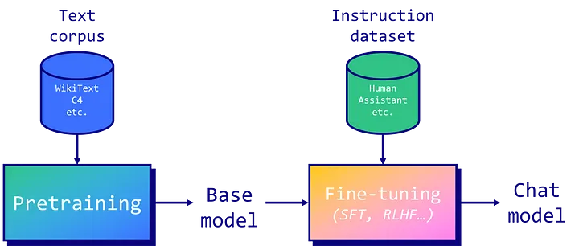

# Fine-Tuning-an-Open-Source-LLM

* Currently this repo contains only a single notebook to simply and effectively fine-tune LLaMa3-instruct model with SFT technique on a custom dataset via LoRA.

* The critical part is data preperation for your own use case. Please note that LLaMa and Mistral family models have different styles of data formatting. In fine-tuned models one may encounter a weird behaviour of generating endless texts! The main rationale is the configuration of EOS tokens and token padding.

* For experimenting I recommend to try different sets of lora hyperparams and various lora target modules. 
